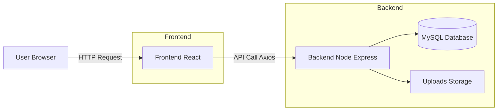
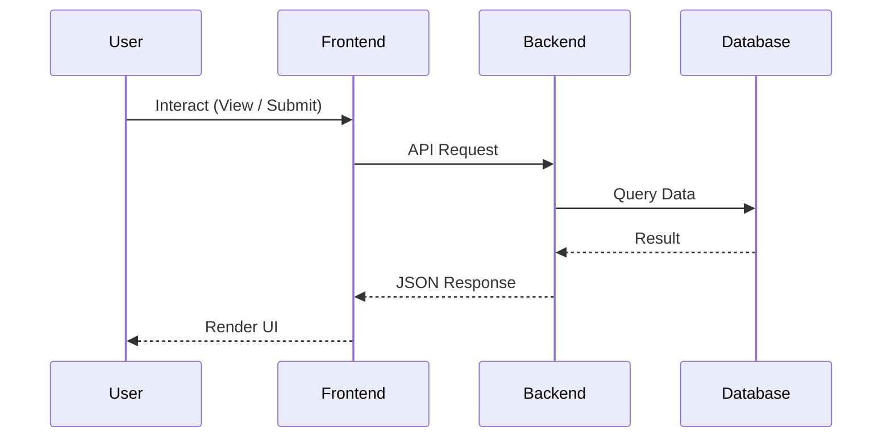

# 🌿 C-SERM UNAS Website

<p align="center">
  <a href="https://csermunas.vercel.app/">
    
  </a>
  
  
  
</p>

<p align="center">
  🌐 <strong>Live Demo:</strong><br/>
  <a href="https://csermunas.vercel.app/">https://csermunas.vercel.app/</a>
</p>

---

## 📌 Overview

The **C-SERM UNAS Website** is the official digital platform of
**Centre for Sustainable Energy & Resources Management (C-SERM)** — Universitas Nasional.

This project delivers a **modern, scalable, and responsive web experience** for showcasing:

* Institutional activities
* Research & publications
* Projects & collaborations
* Organizational structure

---

## ✨ Features

### 🌐 Public Website

* Fully responsive modern UI
* Interactive hero slider (Swiper.js)
* News & updates system
* Project showcase
* Publications page
* Team directory
* Contact form

### 🔐 Admin Panel

* Secure authentication system
* Full CMS capabilities:

  * Manage News
  * Manage Projects
  * Manage Publications
  * Manage Teams
  * Edit Homepage Content
* Image upload & storage system

---

## 🧩 Tech Stack

| Layer    | Technology                                  |
| -------- | ------------------------------------------- |
| Frontend | React.js, Tailwind CSS, Axios, React Router |
| Backend  | Node.js, Express.js                         |
| Upload   | Multer                                      |
| Auth     | JWT (optional)                              |

---

## 🏗️ Architecture Diagram



---

## 🔄 Data Flow



---

## 📁 Project Structure

```bash
CSERM_UNAS/
│
├── backend/
│   ├── config/
│   ├── controllers/
│   ├── middleware/
│   ├── routes/
│   ├── uploads/
│   └── server.js
│
├── src/
│   ├── assets/
│   ├── components/
│   ├── pages/
│   ├── services/
│   ├── App.jsx
│   └── main.jsx
│
├── public/
├── package.json
└── README.md
```

---

## 📸 Preview

> 💡 *Tip: Add more screenshots to improve project presentation*

<p align="center">
  
</p>

<p align="center">
  
</p>

---

## 🌐 Environment Variables

Create a `.env` file in the frontend directory:

```env
REACT_APP_API_URL=http://localhost:5000
```

---

## 🖼️ Image Handling

* Upload directory:

```bash
/backend/uploads
```

* Access images:

```bash
http://localhost:5000/uploads/your-image.jpg
```

* Enable static serving in backend:

```js
app.use("/uploads", express.static("backend/uploads"));
```

---

## ⚙️ Deployment Notes

✔ Ensure the following before deployment:

* API URL is correctly configured
* Backend server is publicly accessible
* Uploads directory is properly exposed

---

## 📬 Contact

**Centre for Sustainable Energy & Resources Management (C-SERM)**
Universitas Nasional, Jakarta

🌐 [https://cserm.unas.ac.id](https://cserm.unas.ac.id)
📧 [contact@cserm.unas.ac.id](mailto:contact@cserm.unas.ac.id)

---

## 📜 License

MIT License — free for educational and non-commercial use.

---

## ⭐ Support

If you find this project helpful:

* ⭐ Star this repository
* 🍴 Contribute to development

